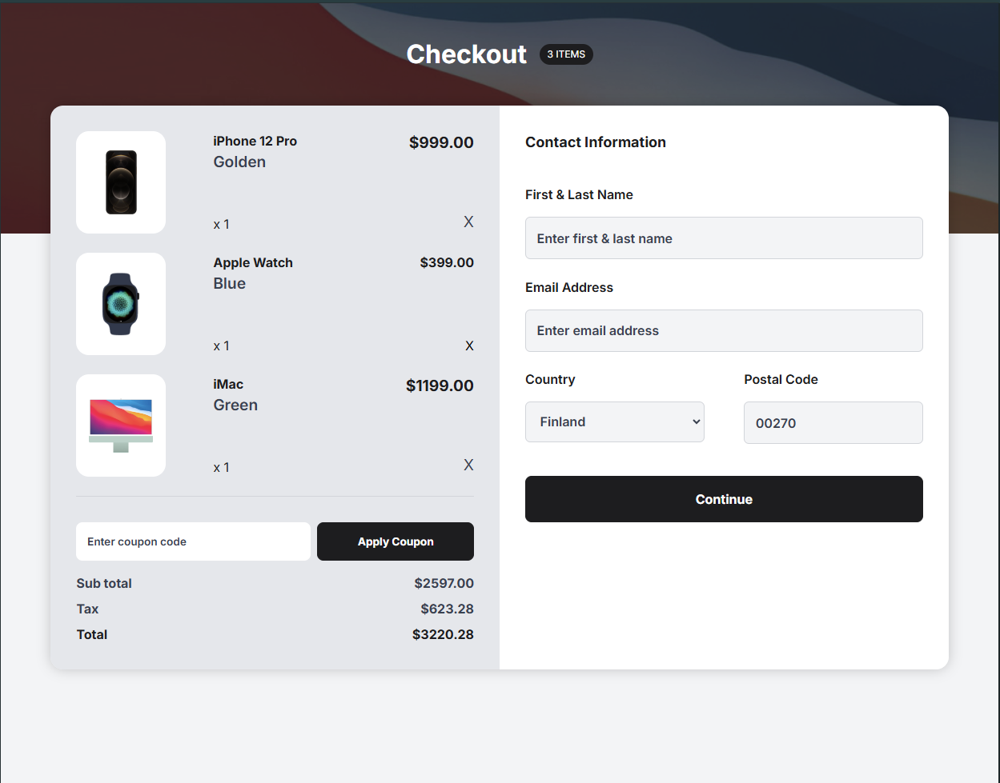

<h1 align="center">Cart Apple Shop Checkout | devChallenges</h1>

   Solution for a challenge <a href="https://devchallenges.io/challenge/apple-shop-checkout-page-challenge" target="_blank">Device Shop Checkout</a> from <a href="http://devchallenges.io" target="_blank">devChallenges.io</a>.

  <h3>
    <a href="https://chimerical-bavarois-e1261c.netlify.app/">
      Demo
    </a>
     | 
    <a href="https://github.com/Robertron624/devchallenge-shop-checkout">
      Solution
    </a>
     | 
    <a href="https://devchallenges.io/challenge/apple-shop-checkout-page-challenge">
      Challenge
    </a>
  </h3>

<!-- TABLE OF CONTENTS -->

## Table of Contents

- [Overview](#overview)
    - [What I learned](#what-i-learned)
    - [Useful resources](#useful-resources)
    - [How to start](#how-to-start)
- [Built with](#built-with)
- [Features](#features)
- [Author](#author)

<!-- OVERVIEW -->

## Overview

### What I learned

With this project I practiced my flexbox and grid skills, also I put effort on making the page the most accessible as possible by using semantic HTML, focus states, aria attributes and finally using media queries
and the picture element to handle the different versions of the product images and the top section image.

### Useful resources

- [The Picture element](https://developer.mozilla.org/en-US/docs/Web/HTML/Element/picture) - This helped me to use the picture element to handle the different image resolutions

### How to start

To start using this project, follow these steps:

1. Clone the repository: `git clone https://github.com/Robertron624/devchallenge-shop-checkout.git`
2. Navigate to the project directory: `cd devchallenge-shop-checkout`
3. Open the index.html file in your preferred browser or use a live server extension in your code editor to run the project.

Now you can see the project running locally on your machine. Happy coding!

### Built with

- Semantic HTML5 markup
- CSS custom properties
- CSS variables
- CSS Media Queries
- Flexbox
- CSS Grid

## Features

- User can see a cart with a list of products with their corresponding information(price, quantity, etc.)
- User can remove products from the cart
- User can view the total price of the products in the cart
- User can see a form where they can enter their personal information for shipping

This application/site was created as a submission to a [DevChallenges](https://devchallenges.io/challenges-dashboard) challenge.

## Author

- Website [robert-ramirez.netlify.app](https://robert-ramirez.netlify.app/)
- GitHub [Robertron624](https://github.com/Robertron624)